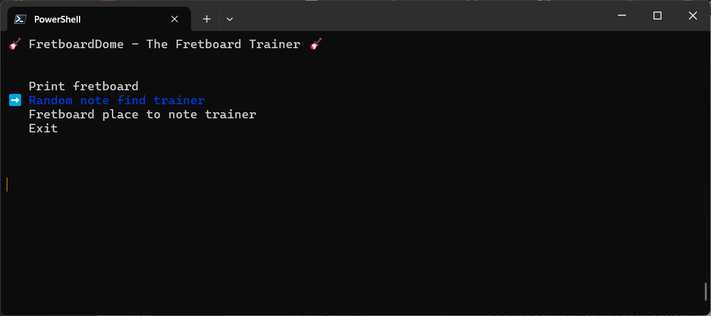

# FretboardDome - The Fretboard Trainer

## Description

FretboardDome is a fretboard trainer tool to train memorize the notes on an fretboard of a guitar.
Run FretboardDome.py to start the application.

## Screenshots

## Ideas

- Improve controls and output with one key press
- Feature that show notes, scales, chords of a key
- Add a GUI
- Settings
- Setting to mandolin or banjo